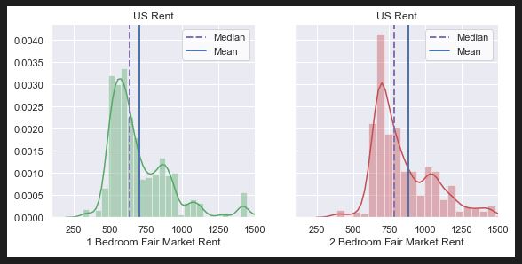
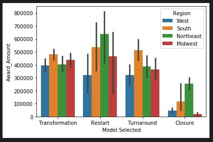
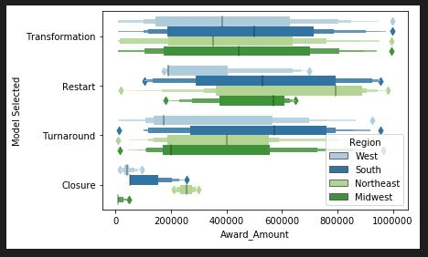
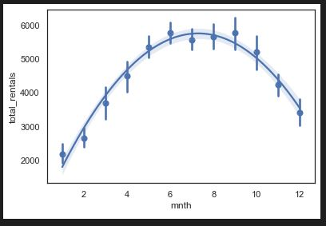
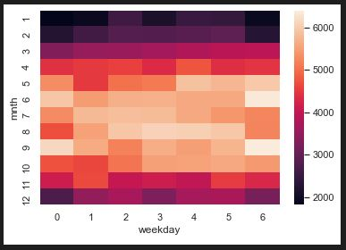
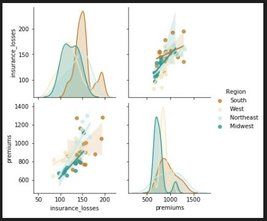

# Data Visualizations Using Seaborn
Welcome to my repository featuring a variety of data visualizations using the python library Seaborn. Seaborn is a powerful visualization tool that allows the creation of a wide variety of graphs. These graphs allow for users to effectively and easily analyze complex data sets

## projects
notebooks used to create data visualizations examples

### Data Visualization Examples
This is an example of a distribution plot that shows the fair market rent for one bedroom and two bedroom apartments. Lines showing the median and mean prices have also been included. This kind of plot allows for easy comparison of two variables along with key metrics useful for analysis

[Styles Plots Reg maps](StylesPlotsRegMaps.ipynb)

This is a bar plot that shows the award amount of grants at colleges around the country. This kind of visualization is simple to read.

[Categorical Plot NoteBook](categoricalPlots.ipynb)

Here we see a lv plot. This plot shows key metrics such as interquartile range, mean and median. Because it is color coded you are able to see three key metrics from the data set easily. 

[Categorical Plot NoteBook](categoricalPlots.ipynb)

This is a regression plot that shows the number of bike rentals compared with the month of the year. It also includes the mean for each month. Seaborn makes it very easy to plot regression lines because it includes the necessary functions.

[Styles Plots Reg maps](StylesPlotsRegMaps.ipynb)

This is a heat map that shows the correlations between all the variables in a data set. The lighter the color is the higher the correlation is between the 2 variables. These kinds of plots are very useful because you can use them to quickly analyze a data set and then use the information to help create models. 

[Styles Plots Reg maps](StylesPlotsRegMaps.ipynb)

This is a Pair Plot that shows multiple kinds of plots in a single image. This particular plots shows the regressions lines between 2 variables organized by a category and the same variables distribution. These kinds of plots are great for comparing multiple metrics and variables quickly and easily.

[Grid Plots](gridPlots.ipynb)

